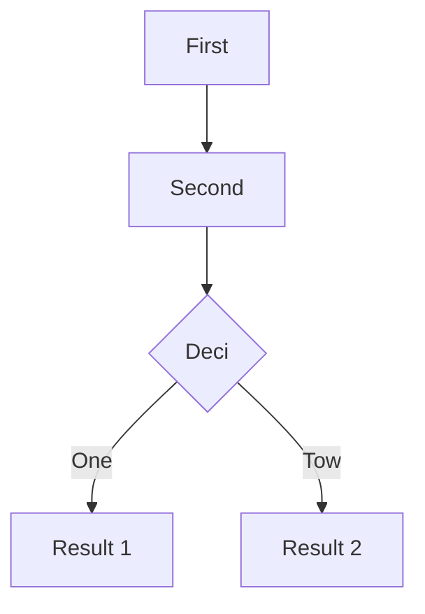
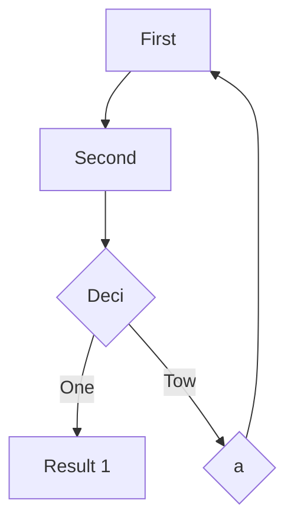
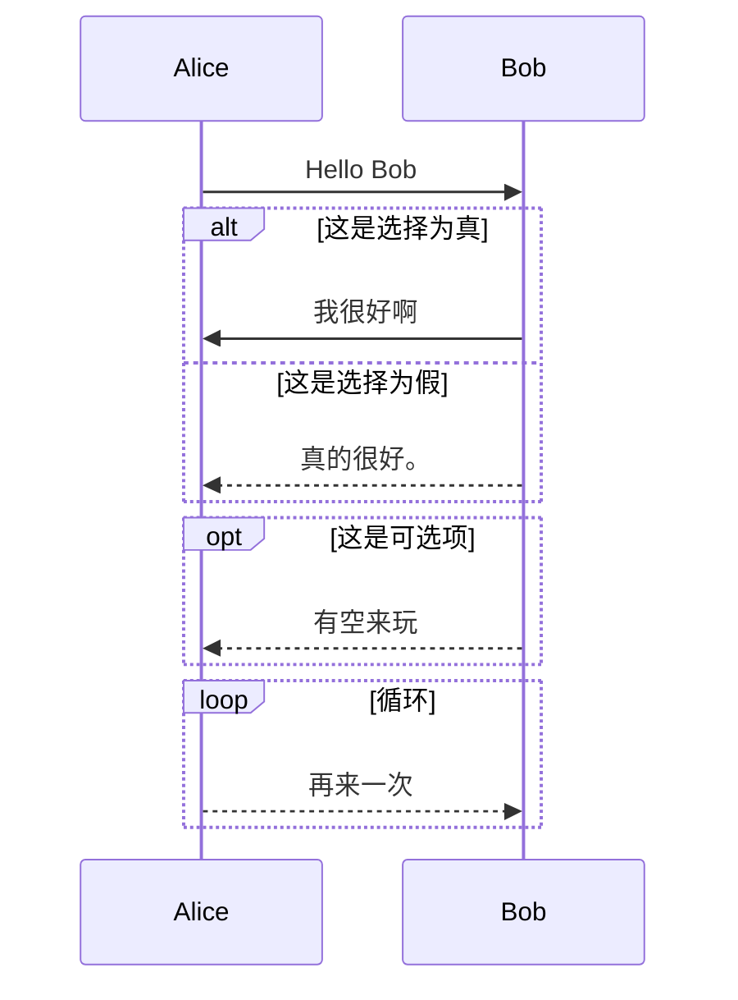

# Typora 简单使用说明

该文档就是使用Typora进行的编辑，可以使用快捷键(`ctrl+/`)对MD源码和视图进行切换。

## 软件下载与安装
- 下载地址 [http://10.21.49.130/other/git/](http://10.21.49.130/other/git/)，

- 按说明进行安装

## 简单配置

初始情况下，Typora并不会对标题进行编号，如下图所示


由于Typora也是采用CSS进行显示控制，所以我们可以通过修改CSS的方式进行修改。

1. 打开偏好设置（Ctrl+，`逗号`或菜单`文件|偏好设置`）；
2. 打开`主题|主题文件夹`，选择 Github.css ,如下图

在文件的最后增加 [markdown-write-report.md](markdown-write-report.md) 讲述的内容。

> /* 给标题进行编号
> == add by cshao
> =============================================*/
> body {
> counter-reset : h1_counter;
> }
>
> h1 {
> counter-reset : h2_counter;
> }
>
> h2 {
> counter-reset : h3_counter;
> }
>
> h1:before{
> counter-increment: h1_counter;
> content: counter(h1_counter) ". ";
> }
>
> h2:before{
> counter-increment: h2_counter;
> content: counter(h1_counter) "." counter(h2_counter) " ";
> }
>
> h3:before{ 
> counter-increment: h3_counter;
> content: counter(h1_counter) "." counter(h2_counter) "." 
>         counter(h3_counter) " ";
> }
>
> /* 强制 标题 1 处分页
> == add by cshao
> */
> @media print {
> h1 {
>  page-break-before: always;
> }
> h1:first-of-type {
>  page-break-before: avoid;
> }
> }
>
> /* 代码颜色==*/ 
> code {
> color: #ff2222;
> }
>
> ​    /* ==  段前首行缩进  add by cshao */
> p { 
> text-indent:2em;
> }
>
> /* 设置 表格属性，表格占整个页面90%宽，上、下边线加粗*/
>
> table {
> 	width: 90%; border-top-style: solid; 
> 	border-right-style: none; 
> 	border-left-style: none; 
> 	border-bottom-style: solid; border:1; 
> 	cellpadding:"0"; cellspacing:"0";
> 	align:center; margin:auto;
> }
>
> /* 设置 表格属性，第一列占表宽20%*/
>
> table td:nth-child(1) {
> width: 20%;
> }

3. 重启 Typora 或 (通过主题菜单)切换主题，即可见到已经增加编号。

## 表格输入 

在 Typora 中可以使用标准的 Github方式进行表格输入 ,只要输入`|a|b |`然后再回车即可。

### 建立一个表格

输入下面内容

``` markdown
| A | B | C |
|:-| :-:|-:|
|这是A的内容，<br> 左对齐|这是B的内容|这是C的内容|
||居中中对齐||
|||右对齐|
```

显示结果如下：

| A                   |      B      |           C |
| :------------------ | :---------: | ----------: |
| 这是A的内容， <br> 左对齐 | 这是B的内容 | 这是C的内容 |
|                     | 居中中对齐  |             |
|                     |             |      右对齐 |

>第一行是表头信息；
>
>第二行是对齐格式，必须在第二行。
>
>输入的`<br> `进行换行

### 分页 

 如果表格比较大，可以在每个表格前强制进行分页。分页可以使用用 CSS `<div style="page-break-after: always;"></div>` 。下面表格前进行分页（只有导出打印时才有效果）。

<div style="page-break-after: always;"></div>


| 项         | 内容                                                         |
| ---------- | ------------------------------------------------------------ |
| 用例编号   | 这里给出用例编号                                             |
| 用例名     | 这里给出用例名称，要与用例图中的一致                         |
| 用例描述   | 对用例功能时行简单描述                                       |
| 参与者     | 用例的参与者，一般是用例的使用者                             |
| 前置条件   | 用例可以执行的前提条件（只有这个条件为真，该用例才会执行）   |
| 后置条件   | 用例主事件流结束后系统应具有的状态，比如对于增加记录的用例“系统成功增加一条记录” |
| 主事件流  | 用例为了完成功能而必须进行的交互，这里只写成功事件流，不考虑各个步骤的出错或特殊情况。事件流是一个事件（操作）序列，从1开始编号。每个事件要包含事件参与双方和操作，形式上是一句描述性的陈述句。 |
| 备选事件流 | 主事件流中所有可能出现的分支都写在这里，对每个编号加2级编号进行书写。一般来说，这里包括的都是出错处理。 |


## 公式的输入-行间公式(math block)

Typora 可以使用LaTex语法进行公式的输入。只要输入两个美元符号(`$$`)即可，或者菜单或鼠标右键插入`公式块`。

下面输入公式`$$ a^2=b^2+c^2 $$` 的显示效果:
$$
a^2=b^2+c^2
$$

## LaTex常用公式输入说明

在 LaTex文档中，它是通过特定的命令来控制输出显示。这些命令要通过 `\`来指示。并且数据的组合使用花括号。LaTex属于自由书写格式，空格与分行一般不影响输出效果。因此为了便于阅读和修改，建议每个控制命令书写在一行，并采用缩进的方式。

一般来说，Latex控制命令都可以嵌套。

### 数据的输入

如果键盘上有的数学符号，可以直接进行输入。但花括号必须使用转义符`\{\}`进行显示。公式中所有输入的空格将被忽略。但是可以用下面控制命令增加空格

- \qquad  ：增加两个空(quad)宽度
- \quad ：增加一个空宽度
- \;    ：增加5/18 空宽度
- \   :  增加一个空格（注意`\`后面有一个空格）
- \hspace{长度}

如果在在公式中输入文字并保留空格，则要使用 `\box{文本}`.

### 行内公式

出现在一行的叫行内公式。见下节内容[](#行间公式)

### 行间公式

出现在行之间的叫行间公式。即本节内容

### 公式编号

- `\eqno`   编号在公式右边
- `\leqno` 编号在公式左边

### 上标和下标

- 上标 ^{...}

- 下标 _{...}

上标和下标的输入顺序无关，并且可以嵌套。如果内容是一个字符可以省略花括号。

`$$ x_1, x_1^2, x^2_1, x_{11}^{22}, x^{(22)}, x^{x^2} $$` 输出如下结果

$$
x_1, x_1^2, x^2_1, x_{11}^{22}, x^{(22)}, x^{x^2}
$$

###   分式

`\frac {分子}{分母}`

### 根式

-  开平方 `\sqrt {表达式}`
- 开高平方 `\sqrt [n]{表达式}`

### 求和、求积

- 求和 `\sum_{k=1}^n`
- 求积`\int_a^b`

### 上划线、下划线

- 上直线 `\overline{公式}`

- 下直线 `\underline{公式}`

- 上花括号 `\overbrace{公式}`

- 下花括号`\underbrace{公式}`

输入 

~~~latex
\underbrace {
    a + \overbrace {b + \dots}
} _{20 \mbox{个}}
~~~

显示如下
$$
\underbrace {
    a + \overbrace {b + \dots}
} _{20 \mbox{个}}
$$

### 将符号进行堆积

#### 一般堆积

堆积就是将两个符号放在一起，一个在上面，一个在下面。比如我们在大于等于符号，可以将两个符号堆积起来，命令是`\stackrel{上位符号}{基位符号}`。

输入

~~~latex
A \le B \stackrel {<}{=} C

~~~

显示如下：
$$
A \le B \stackrel {<}{=} C
$$

#### 平等堆积

可以使用 `\choose`，比如组合公式.

输入

```latex
{a \choose b}

```

显示如下：
$$
{ a \choose b}
$$
如果是多层堆积，则要使用 矩阵命令 `\begin {array}`

### 可变定界符号

就是数学中可变的的括号或竖线之类

输入

```latex
(， \quad |， /， \quad \\
\lfloor, \quad \uparrow \\
\bigg( \langle \\
\Bigg( \langle

```

显示如下：
$$
(， \quad |， /， \quad \\
\lfloor, \quad \uparrow \\
\bigg( \langle \\
\Bigg( \langle
$$

> 注意： `\\`双线是控制换行的命令， `big`,`bigg`,`Big`,`Bigg`是控制大小的命令。
>
> 对于自适应的变化可以使用 `\lef ... \right...`控制。

### 矩阵

矩阵中每行中的数据用`&`进行分隔，行之间用`\\`进行分隔，最后一行可以不用。

```
begin {array} [竖向位置]{列格式}
第一行 \\
。。。
最后一行 
\end {array}
```

输入

```latex
\left(
	\begin{array}{}
	11 & 12 & 13 \\
	21 & 22 &
	\end{array}
\right)
```

显示如下：
$$
\left(
	\begin{array}{}
	11 & 12 & 13 \\
	21 & 22 & 23
	\end{array}
\right)
$$


上面有左括号和右括号，下面看一个半括号的例子


```latex
f(x)=\left\{
	\begin{array}{}
	x & x\gt0; \\
	-x & other
	\end{array}
\right.
```

显示如下：
$$
f(x)=\left\{
	\begin{array}{}
	x & x\gt0; \\
	-x & other
	\end{array}
\right.
$$
注意： `\right.`,right后面是一个小点。

### 多行公式

可以使用 命令 \begin {eqnarray} 书写多行公式，注意下面例子中`&`符号的作用。它起到定位的功能，第三行是小写一个 &的效果。


### 字体

支持下面字符 \mathrm \mathit \mathtt \mathsf \mathbf \matchcal，即

- rm :Roman
- it : 斜体
- tt：

$$
\mathrm{abc   \Gamma} \\
\mathit{abc   \Gamma} \\
\mathtt{abc   \Gamma} \\
$$

### 希腊字母和各种符号

- \alpha, 小写的 
- \Alpha, 大小的


## 公式的输入-行内公式（inline math）

行内公式指的是在文本行内出现的公式。要使用行内公式要先打开`Preference` Panel -> `Markdown` Tab ，见下图。输入一个`$`符号后要再按`ESC`键进入该模式。

下面是一个行内公式的例子`$\frac{1}{2}$`.这是一个分数二分之一的例子：$\frac{1}{2}$。其它内容与行间公式类似。

## 流程图绘制

使用 http://flowchart.js.org/ 提供功能。使用前，要打开扩展MD语法。打开`Preference` Panel -> `Markdown` Tab，

### 使用方式 

输入 代码符号`(```)`并输入 seq后, 就可以直接选择 `flow`

### 例子

~~~markdown
```flow
st=>start: 开始
op=>operation: 操作
cond=>condition: Y or N
e=>end

st -> op -> cond
cond(yes) -> e
cond(no)-> op
```
~~~


```flow
st=>start: 开始
op=>operation: 操作
cond=>condition: Y or N
e=>end

st -> op -> cond
cond(yes) -> e
cond(no)-> op
```

### 另一个例子

输入

~~~markdonw

~~~



> graph：声明一个图并指明方向。 TD 指的是由上到下 ，还可以是 LR，由左到右。
>
> A： 结点。这是一个结点
>
> A[文]：这是一个带文本的结点。
>
> A(文)：这是一个带文本的圆角结点。
>
> A（(文）)：这是一个带文本的圆结点。
>
> A  >文）)：这是一个带文本的尖结点。
>
> A{文}：这是一个带文本的判断结点。
>
> A --> B:  带箭头连接
>
> A -- B:  无箭头连接
>
> A ---文本-- B:  带文本连接
>
> A --->|文本|--> B:  带文本箭头连接
>
> 

## 序列图绘制

使用的是 https://www.websequencediagrams.com/提供的功能。可以参见 https://bramp.github.io/js-sequence-diagrams/#syntax。使用前，要打开扩展MD语法。打开`Preference` Panel -> `Markdown` Tab，

### 使用方式 

输入 代码符号`(```)`并输入 seq后, 就可以直接选择 `sequence`  ，见下图


### 例子

~~~ markdown
```sequence
#Alice到Bob的实线（一个 -）
Alice->Bob: Hello Bob, how are you?
#Bob右边的注释
Note right of Bob: 为什么不说中文？  
#Bob到Alice的虚线（二个 --）
Bob --> Alice: Can you speake Chinese?
```
~~~
```sequence
# Alice到Bob的实线（一个 -）
Alice->Bob: Hello Bob, how are you?
#Bob右边的注释
Note right of Bob: 为什么不说中文？  
#Bob到Alice的虚线（二个 --）
Bob --> Alice: Can you speake Chinese?
```

### 又一种序列图

使用 https://mermaidjs.github.io/

- 输入

~~~ markdown

~~~

- 显示


