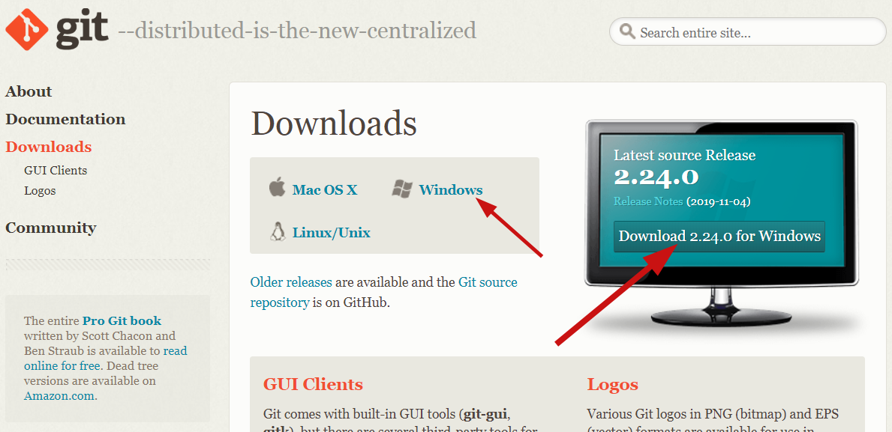

Git的使用

---

## 一、实验目的
1. 学习 Git 软件的安装
2. 学习 Git 的简单使用，增加文件，提交，创建分支，增加远程，下拉、上推，合并
3. 学习 Git 的冲突处理 

## 二、实验平台
 实验平台选择Windows 10系统，该系统使用人群广泛，交互界面十分良好，而且操作起来简单方便。

## 三、实验前准备
1. 搜索浏览[Git官网](https://git-scm.com/downloads)，根据自己所使用的操作系统下载相应的 Git操作工具。
2. 翻阅相关资料，掌握分布式版本控制系统 Git 的基础知识。
3. 查找 Git 的使用教程，熟悉 Git 命令以及 Git GUI 的使用，以及一些更高级的操作。

## 四、实验内容

### 4.1 Git安装流程

#### （1）获取Git安装程序

 到Git官网下载，根据自己的操作系统进行下载，这里采用window浏览，Git官网自动之别到了我使用的操作系统，点击下载后可以得到Git-2.24.0-64-bit.exe文件。点击进入安装过程

####  （2）使用许可声明

阅读完并点击 next 进行下一步安装。

####  （3）选择安装的组件

我们可以选择：

1. 绿框表示是否创建快捷键图标和window更新相关，建议不要进行勾选
2. 在右键菜单中添加"Git Bash Here"和"Git GUI Here"，这样我们可以在任意文件路径中通过右键菜单打开 Git
3. 关联 .git 和 .sh 文件到 Git

#### （4）设置路径环境变量

这个界面是设置PATH环境我们可以选择配置，选择第二种配置，我们可以从Git Bash，命令提示符和Windows PowerShell以及在PATH中寻找Git的任何第三方软件中使用Git，这里推荐选择第二种配置

#### （5）选择换行格式

#### （6）配置Git Bash的终端模拟器

#### （7）配置额外的选项

我们可以选择启用文件系统缓存。

#### （8）配置实验性选项

#### （9）安装进度指示	

#### （10）安装完成

等待安装完后，我们可以在之后的界面选择立即启动 Git Bash和 查看当前的版本说明。

### 4.2创建本地仓库
（1）首先我们创建后一个目录，然后在文件夹里面右键点击打开 Git Gui，选择create New Repository。

（2） 选择仓库路径，点击create后目录会出现.git文件。

（3）也可以右键打开git bash，输入git init 命令也会生成.git文件

（4）产生.git表示本地仓库创建成功，进入git gui界面就可以进行相关可视化的操作了。

### 4.3 Git 的提交
1. 把我们想 commit 的文件加入到 暂存区 Staged Changes(Will commit),可以直接点击 Stage Changed。

  

2. 如果我们这时候直接点击 Commit,会发现 Commit失败,这是因为我们没有输入我们的用户信息。可以用以下方法解决：

  

  点击菜单栏上的 Edit,选择 Options，然后输入User Name 和 Email Address，最后点击save之后便可以了。

  

3. 接着，我们再次点击 Commit之后，我们会发现还是提交失败，这是因为我们没有填写 Commit Message。
    

4. 填写完 Commit Message 之后我们便可以继续点击提交。
    message

5. 点击commit进行提交 ，可以在历史记录进行查看提交记录。

  

6. Commit之后我们点击 Push，选择提交的分支。

  

******

7. 输入用户名和密码之后便成功地 Push到远端了。
    

#### 4.3 创建分支
1. 点击菜单栏上的 Branch，输入相应的分支名字，并点击 Create 进行创建
  

2. 创建完成后，分支列表显示该分支。

   

#### Git 冲突
1从远端拉取别人上传的内容,输入用户名和密码之后便拉取成功。

2.进行会产生冲突的操作，master本地commit新的文件，然后push提交到远端，会发现提交失败。因为远端的版本比我的版本要新（别人有提交新的内容），我需要先下拉远端最新的版本，然后点击 Merge 合并。

4.在菜单上点击Merge进入界面，选择要合并的分支。

5.合并失败。

6.查看冲突信息。

7.解决冲突。

8.再次提交

10.提交成功，意味着冲突已经解决

## 实验总结
​	通过对Git工具的使用，让我体会到了它的强大之处，它可以有效的运用于团队之间的协作开发。经过这次实验中的Git操作的练习，让我理解到了分布式版本控制系统确实较于集中式版本控制系统更为好用以及有效率，每个开发者都拥有自己的版本控制库，在自己的版本库上可以任意的执行提交代码、创建分支、拉取合并等行为。在实验中初步掌握了Git 的安装和简单使用，增加文件、提交、创建分支、增加远程、下拉、上推、合并，能比较熟悉地使用 Git 命令或者 Git GUI 对自己的仓库进行版本管理。

​	在Git的操作过程中遇到的合并冲突问题让我印象非常深刻，因为不同合作者在操作同个文件的时候，修改之后拉取合并可能会产生冲突，然后我也学会了去查看冲突信息，找到发生冲突的地方，并作出修改解决冲突，最后才能再次提交并推送到远程仓库。通过一系列的操作，最终解决了合并存在的冲突

​	经过本次的实验，结合课堂上学习到的理论知识，不断地进行实践，让我对Git地操作更加熟悉，也加深了对理论知识的理解，整个过程的学习让我收获了不少知识。