# 一、绪论

## 1.题目背景及意义
​		随着信息技术的不断进步，博客开始进入人们的生活，博客是一种十分简易的个人信息发布方式，是开放的空间，可以充分利用超文本链接、动态更新等特点，在网络中精选并链接到全球互联网最有价值的信息和知识。之前人们会在各种论坛发表贴子或通信软件聊天来发表自己的想法，但却都是凌乱不清晰的，而博客的出现，可以让人们将个人的生活故事、思想历程、学习技术等及时记录和发布，并且非常容易整理，这就使得信息的共享和交流技术等方面更加便捷。用户在编写博客时，能够发挥出自己无限的表达力，完成博客后得到大家的认同也会获得满足感。更可以在上面结交好友，交流技术提升自己，为自己的人生留下一些宝贵的回忆。而且写博客还能激起自己的学习兴趣，不会让时光流逝无声无息。可见在当代社会，个人博客系统的设计是非常重要的，能促进广大用户间信息的交流和传递。

​		本次课程设计实现一款基于 B/S 风格的 Web 应用程序，采用Java开发语言和MySQL数据库管理相结合，开发一款个人博客系统，可以满足博主发布博客，而且游客用户可以通过该系统浏览博客、评论博客、搜索相应博客信息等功能，博主可以进入后台管理系统进行博客信息的相关修改。

## 2.国内外现状

​		随着信息技术的不断推广，我国的博客发展十分迅速，各行各业均匀涉及。随着各大门户网站的强力推动，博客数量增长飞进。其中新闻类博客和财经类博客最引人关注，这些博客在传递新闻事件中起到不可忽视的作业，为大众提供了一种新的舆论监督平台。 由于博客沟通方式比电子邮件、讨论群组更容易和简单，博客已成为家庭、部门、公司和团队之间越来越盛行的交流工具。相关技术水平和西方国家差距不大，在互联网上形成的博客体系日益完善，不断成熟。

​		但在移动领域中的发展较为缓慢，功能不太齐全，很大限制移动端博客的发展。还有目前市场上各大网站的博客都各具特色，但是在功能上或多或少存在缺失。

## 3.关键技术简介

​		本次课程设计所用到的框架和技术主要有springboot、Thymeleaf模板引擎、maven管理、mysql数据库这几个点，借助这几个技术实现了代码编写、配置管理、数据交互，贯穿了个人博客系统的整个开发过程。

​		Spring Boot是由Pivotal团队提供的全新框架，其设计目的是用来简化新Spring应用的初始搭建以及开发过程。该框架使用了特定的方式来进行配置，从而使开发人员不再需要定义样板化的配置。因此使用springboot框架对于一个项目的搭建是非常快速的，对于开发人员编写代码是非常有帮助的。springboot内嵌Tomcat或Jetty等Servlet容器、能进行自动配置Spring容器，除此之外它还遵循一个约定优于配置的原则，这就保证了开发人员摆脱了复杂的配置工作以及依赖的管理工作，更加专注于业务逻辑。所以在本次的框架使用上选择了springboot来进行后台代码的开发，还结合Thymeleaf模板引擎编写前端html代码，而且在使用springboot框架的时候是推荐使用Thymeleaf模板引擎，两者搭配起来开发前后端代码更加快速便捷。

​		Maven是一个项目管理工具，可以通过一小段描述信息来管理项目的构建，报告和文档的项目管理工具软件。它包含了一个项目对象模型，一组标准集合，一个项目生命周期，一个依赖管理系统，和用来运行定义在生命周期阶段中插件目标的逻辑。这就使得了我们想要引用某些具备特定功能的外部插件，就不需要下载jar后放入项目中了，只需要对pom.xml进行依赖引入和管理，还可以对依赖版本进行控制，这就大大防止了有时候我们所引入的外部依赖版本不兼容出错的情况，这对于一个项目各个插件依赖引入更加方便简单。

​		MySQL数据库是一个关系型数据库管理系统，属于 Oracle 旗下产品。MySQL 是最流行的关系型数据库管理系统，在 WEB 应用方面MySQL是最好的 RDBMS 应用软件之一。而且MYSQL还是开源免费的，使用SQL语言实现对数据的增删改查，对于千万级别的数据量可以完美支持，用以开发一个博客系统绰绰有余。它所支持的数据类型也是非常丰富齐全的，学习起来也不是很困难，综合几个因素考虑，选择了MYSQL数据库作为整个系统后台数据的存储。

## 4.论文的构成及主要工作

本文的结构及内容如下： 

第一章绪论：分析目前的系统应用前景，指出开发该系统具有什么样的意义，确定本系统主要研究的目标及内容； 

第二章需求分析：主要解决系统“做什么”的问题，将系统目标具体化为用户需求，再将用户需求转换为系统的逻辑模型,得出该系统主要需要实现的核心功能，确定功能性需求和非功能性需求； 

第三章总体设计，对业务领域的核心功能进行设计，设计系统的结构图和功能模块图； 

第四章详细设计：设计系统的数据库、用户界面、和安全性设计； 

第五章编码实现：给出核心的模块的实现和所编写实现的代码； 

第六章测试与部署：对所编写出来的功能代码进行测试，尽量在开发过程发现系统中可能存在的问题，并定位错误加以处理，以及说明所使用软件的安装和部署过程。


# 二、需求分析
## 1.功能需求分析

1. 博主通过账号密码登录进入博客后台管理。可以发表博客文章、修改博客、删除博客信息，还可以对博客标签和博客分类进行管理。

2. 用户不需登录，可以直接访问博主的个人博客系统主页，对博主发布的博客文章进行浏览，可以根据标签和分类对博客进行筛选查看制定的博客详情。

3. 用户可以在搜索框，输入自己想看的文章内容的关键字进行搜索查询。

4. 用户可以在博客详情页对博客进行评论，输入用户名称和评论内容，相应的博主可以在博客管理界面对评论进行管理。

   <center><B>核心业务流程图</B></center>

   

## 2.性能需求分析
​	一个比较完善的软件系统，除了在功能实现上做到全面，满足用户的需要，还要在性能方面，也应该有好的用户体验和稳定的运行效果。综合用户对系统功能上的需求，系统还应该在以下方面满足一定的性能需求。

（1）访问时间的需求

​	系统要能方便、快捷、有效的实现博主和用户的需求，进行数据的操作速度要快，系统处理信息需要准确和及时。系统对用户操作的响应时间尽量保持在2.5以内，保证用户在访问系统的界面和功能操作不会等待太久。具体地可以体现为：登录时间不超过2秒；查询与检索的业务响应时间不超过2.5秒；打开新的数据显示界面时间不超过1.5秒；功能操作处理的平均响应时间在2秒之间。

（2）系统的安全性需求

​	个人博客系统是基于 B/S 风格的一款 Web 应用程序，在前端方面编写代码需要考虑 web 安全问题，例如跨站脚步攻击以及跨站请求伪造等，系统需要具备一定的安全性。

（3）系统可维护性需求

​	在个人博客系统的开发过程中，需要做到代码规范、结构明晰、文档完备、可读性强，对于所设计的功能和编写的代码加以清晰地说明，方便定位需要进行优化的功能代码，为后续软件的开发迭代奠定基础。

（4） 系统兼容性需求

​		系统处理信息需要可扩充性，使用简单和易维护性，以及系统在不同平台上都能正常运行，具备兼容性和可移植性。保证在不同平台、不同浏览器、不同尺寸的屏幕设备上需要保持一致的界面显示。

## 3.数据流图

### 3.1首层数据流图

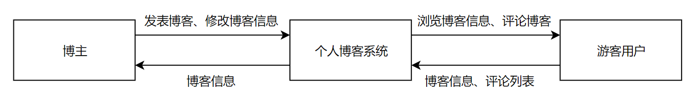

### 3.2第一层数据流图

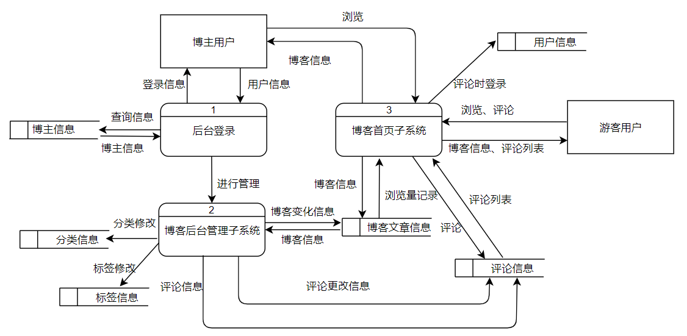

### 3.3第二层数据流图

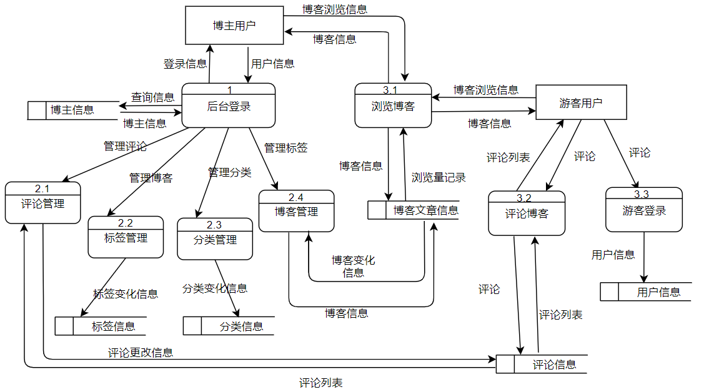

## 4.数据字典

### 4.1 数据项

| 数据项     | 含义说明                   | 类型   | 长度 | 取值含义                 |
| ---------- | -------------------------- | ------ | ---- | ------------------------ |
| 账号       | 用户登录的账号             | 字符型 | 15   | 代表用户的账号           |
| 姓名       | 用户的名字                 | 字符型 | 20   | 仅代表用户的姓名         |
| 电子邮箱   | 用户的电子邮箱             | 字符型 | 11   | 代表用户的电子邮箱       |
| 个性签名   | 博主的个人信息说明         | 字符型 | 50   | 仅代表博主的具体个人信息 |
| 联系方式   | 用户的手机号码             | 字符型 | 11   | 代表用户的联系方式       |
| 博客编号   | 博主发布的博客编号id       | 整型   | 10   | 可以唯一标识代表哪篇博客 |
| 博客标题   | 博主发布的博客标题         | 字符型 | 30   | 代表博客的标题           |
| 博客内容   | 博主发布的博客内容         | 字符型 | 200  | 代表博客的内容           |
| 博客访问量 | 用以记录博客的访问数量     | 整型   | 10   | 仅代表博客被访问的人数   |
| 发布时间   | 博客发布的时间             | 字符型 | 20   | 仅代表博客的发表时间     |
| 分类编号   | 标识每一个博客分类         | 日期   | 6    | 代表分类的编号           |
| 分类名称   | 用以表示每个分类的名称     | 字符型 | 10   | 代表分类的名称           |
| 评论编号   | 标识游客所评论的每一条评论 | 整型   | 10   | 评论的id                 |
| 评论者名称 | 用以记录评论者的名称       | 字符型 | 20   | 表示评论了博客的游客名称 |
| 评论内容   | 用以记录评论者的评论信息   | 字符型 | 200  | 代表游客评论的内容       |
| 评论时间   | 评论博客的时间             | 日期   | 6    | 代表游客评论博客的时间   |

### 4.2 数据存储

| 数据存储 | 说明               | 组成                                                     | 数据量 | 存取方式 |
| -------- | ------------------ | -------------------------------------------------------- | ------ | -------- |
| 博主信息 | 博主的详细信息     | 账号，密码，姓名，电子邮箱，<br />个性签名、联系方式     | 无限制 | 随机存取 |
| 博客信息 | 博客详细信息       | 博客编号、博客标题、博客内容、<br />所属分类id、发布时间 | 无限制 | 按序存取 |
| 分类信息 | 博客标签详细信息   | 分类编号、分类名称、创建时间                             | 无限制 | 按序存取 |
| 标签信息 | 博客的标签详细信息 | 标签编号、标签名称、创建时间                             | 无限制 | 随机存取 |
| 用户信息 | 游客的详细信息     | 账号，密码，姓名，电子邮箱，联系方式                     | 无限制 | 随机存取 |
| 评论信息 | 用户评论的详细信息 | 评论编号，用户名字，评论内容，评论时间                   | 无限制 | 随机存取 |

### 4.3 数据流

| 名称     | 描述               | 数据流来源               | 数据流去向  | 数据流组成                                               |
| -------- | ------------------ | ------------------------ | ----------- | -------------------------------------------------------- |
| 博主信息 | 博主的详细信息     | 博主信息表               | 1后台登录   | 账号，密码，姓名，电子邮箱，个性签名、联系方式           |
| 博客信息 | 博客的详细信息     | 2.4博客管理              | 3.1浏览博客 | 博客编号、博客标题、博客内容、<br />所属分类id、发布时间 |
| 评论信息 | 用户评论的详细信息 | 3.2评论博客、2.1评论管理 | 评论信息表  | 评论编号，用户名字，评论内容，评论时间                   |

### 4.4 外部实体

| 名称 | 说明                                                 | 组成                                           | 输入数据流 | 输出数据流                             | 个数  |
| ---- | ---------------------------------------------------- | ---------------------------------------------- | ---------- | -------------------------------------- | ----- |
| 用户 | 使用个人博客系统的游客                               | 账号，密码，姓名，电子邮箱，联系方式           | 用户注册   | 浏览博客信息、博客评论、登录注册       | 600人 |
| 博主 | 博主相当于是管理员的身份对博客系统的相关信息进行处理 | 账号，密码，姓名，电子邮箱，个性签名、联系方式 |            | 博客管理、标签管理、分类管理、评论管理 | 2-3个 |

### 4.5 数据处理

| 名称     | 说明                                 | 输入                                                | 输出                                            | 处理                                                         |
| -------- | ------------------------------------ | --------------------------------------------------- | ----------------------------------------------- | ------------------------------------------------------------ |
| 后台登录 | 博主输入账号密码进行登录             | 博主用户输入账号信息->1                             | 1->博主用户                                     | 根据博主用户输入的账号密码与博主信息表进行匹对。存在且账号密码符合则登录成功，否则提示错误 |
| 浏览博客 | 博主或游客输入可以对博客信息进行浏览 | 游客输入博客浏览信息->3.1,博主输入博客浏览信息->3.1 | 3.1->博主用户，3.1->游客用户，3.1->博客文章信息 | 系统根据用户输入所需的博客浏览信息，如特定分类、关键字进行博客信息匹配，存在数据且展示在页面，否则提示没有相应博客内容 |
| 评论博客 | 游客对博客信息可以进行评论           | 游客用户->3.2                                       | 3.2->游客用户，3.2->评论信息                    | 游客对博客输入评论内容进行评论，评论成功更新评论显示在界面，并存入数据库；评论失败则进行相应错误信息提示 |
| 分类管理 | 博主通过分类管理对分类信息进行修改   | 博主->2.3                                           | 2.3->分类信息                                   | 确保博主已经成功登录的前提下，对分类信息进行增删改查操作，分类信息表相应的数据会进行实时更新 |

# 三、总体设计
## 1.系统框架选择及设计

（1）操作系统：windows 10，windows 7，windows XP。（以自身操作系统为准）

（2）使用软件: 

​		代码编写：IntelliJ IDEA编辑器
​		数据库：MYSQL数据库管理系统
​		建模工具：在线网站draw.io，使用简单，功能齐全
​		文档编写工具：Microsoft office Word 2019，Typora（markdown语法编辑器）
​		项目管理工具：采用maven对项目依赖进行管理

​		项目管理工具：采用maven对项目依赖进行管理

（3）系统框架与技术选择：

​		① 后台语言开发使用Java语言，并且使用SpringBoot快速搭建整个后台的框架，以MVC开发模式对各个功能进行分层开发，controller层与前端代码进行交互，调用service层进行业务逻辑处理，service层调用dao层对数据库数据进行交互。

​		② 在界面的设计上，采用前端语言使用html、js、css结合使用，并使用模板引擎thymeleaf完成了相关功能的开发，采用其自带的语法特点对后台接口返回的数据进行处理。

​		③ 数据库选择mysql进行数据存储，使用MyBatis框架连接数据库进行Sql语句的编写，基于sql语句对数据进行增删改查。通过mybatis使得实体类与数据库的表中数据一一映射，通过对实体类的修改，能修改数据库对应的数据。

## 2.软件模块结构

### （1） HIPO图：

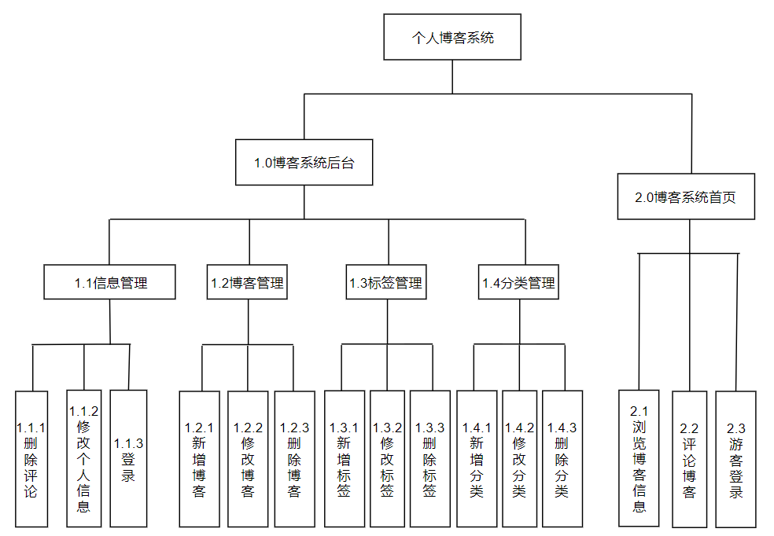

### （2） IPO表：

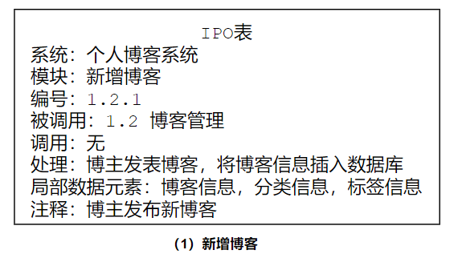

​							


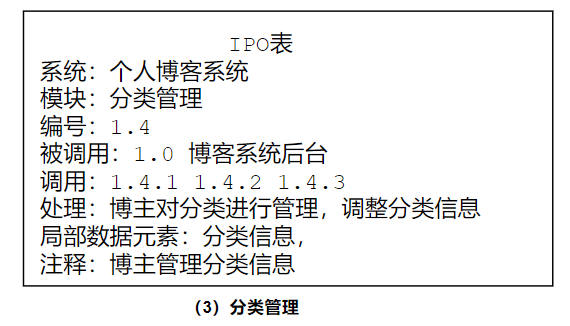


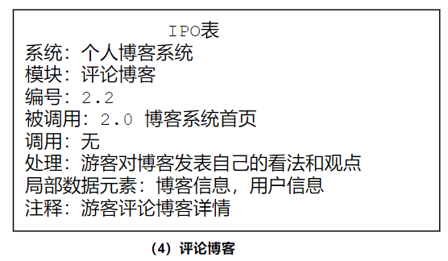

## 3.系统的总体设计

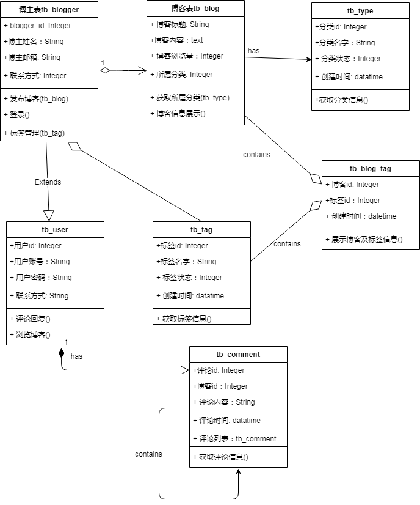

# 四、详细设计
## 1.UI设计

<center><B>博客系统首页</B></center>


<center><B>博客详情页面</B></center>

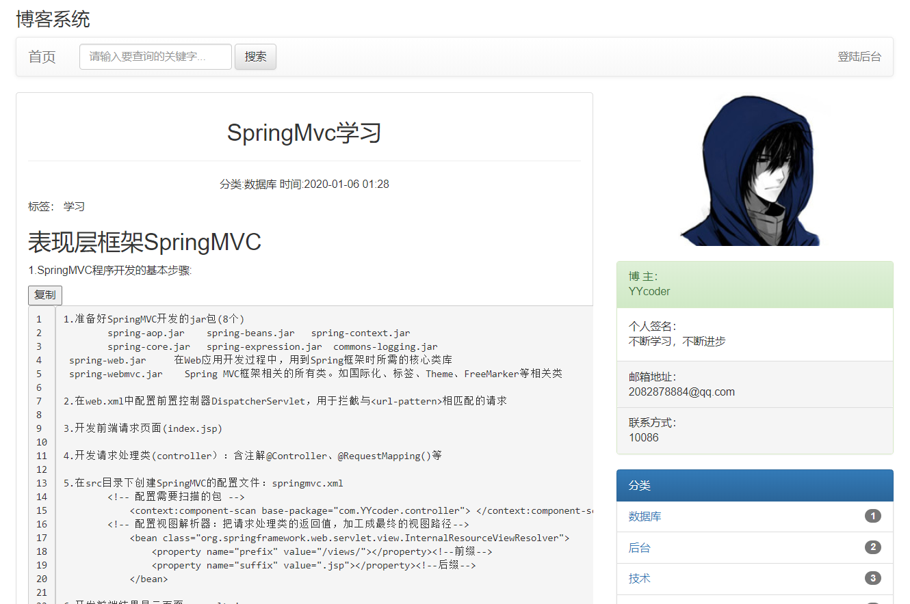

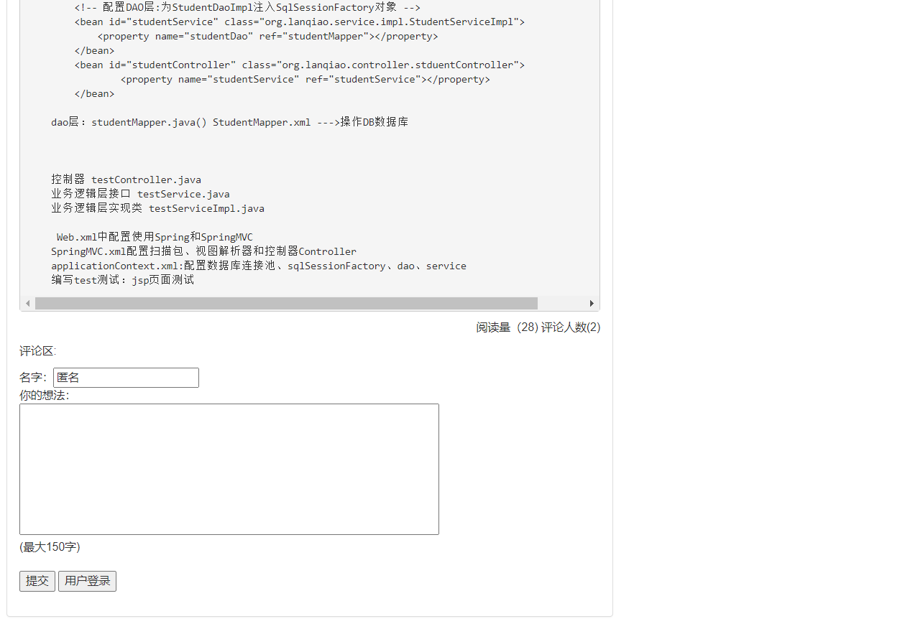

<center><B>博客评论界面</B></center>


<center><B>用户登录注册界面</B></center>


<center><B>博客管理界面</B></center>


<center><B>博客分类管理界面</B></center>


<center><B>博客评论管理界面</B></center>


## 2.数据库设计

### 2.1数据库概念结构设计

**（1）概念结构设计描述**

​		需求分析阶段描述地用户应用需求是现实世界地具体需求，而将需求分析得到的用户需求抽象为信息结构即概念模型的过程就是数据库的概念结构设计。概念结构是各种数据模型地共同基础，它比数据模型更独立与机器、更抽象，从而更加稳定。概念结构设计是整个数据库设计的关键。
​		概念模型是表达概念设计结果的工具，具有以下主要特点:
​		①易于理解，语义清晰，从而可以用它和熟悉计算机地用户交换意见，用户地积极参与是数据库设计成功地关键。
​		②能真实充分地反映现实世界，充分反映现实世界，包括事物和事物之间的联系，能满足用户对数据的处理要求。是对现实世界的一个真实模型。
​		③易于更改，当应用环境和应用要求改变时，容易对概念模型进行修改和补充。
​		④易于向关系、网状、层次等各种数据模型转换。
​		概念结构设计的常用方法是自顶向下进行需求分析，自底向上设计概念结构。一般先对数据进行抽象并设计局部视图，集成局部视图后得到全局概念结构。描述概念模型的工具方式有多种，其中最常用是“实体-联系模型”，即使用E-R图来描述某一组织的概念模型，它将现实世界的信息结构统一用属性、实体以及它们之间的联系来描述。

**（2）总E-R图设计**

 

### 2.2 数据库逻辑结构设计

**（1）逻辑结构设计描述**

​		概念结构设计的任务就是把概念结构设计阶段设计好的E-R模型图转换与选用DBMS产品所支持的数据模型相符合的逻辑结构。逻辑结构是独立于任何一种数据模型的，独立于任何一个具体的DBMS。概念结构设计的一般步骤是首先将概念结构转换为一般的关系、网状、层次模型，然后对转换后得到的关系、网状、层次模型向指定数据库管理系统支持的数据模型转换，接着对形成的数据模型不断进行优化，得到一个优化的数据模型。
​		E-R图向关系模型的转换要解决的问题是，如何将实体型和实体之间的联系转换为关系模式，如何确定这些关系模式的属性和码。将E-R图转换为关系模型：将实体型、实体的属性、和实体之间的联系转换为关系模式。
​		实体型间的联系转换过程中有以下几种情况：
​		①一个1：1联系可以转换为一个独立的关系模式，也可以与任意一端对应的关系模式合并。
​		②一个1：n联系可以转换为一个独立的关系模式，也可以与n端对应的关系模式合并。
​		③一个m：n联系转换为一个关系模式。比如学生对课程的选修就是一个m:n关系，可以转换为关系模式选修（学号，课程号，成绩）。
​		④三个或上个以上实体间的一个多元联系可以转换为一个关系模式。
​		⑤具有相同码的关系模式可合并。目的是为了减少系统中的关系模式

**（2）建立关系模式**

根据画出的ER图及上述关系模式转换原则,建立以下关系模式(关系的码用下划线标出。)
博主表（博主id，帐号，登录密码，博主姓名，个人介绍，电子邮箱，联系方式）
博客表（博客id，博客标题，博客内容，所属分类id，阅读量，发布时间，博主id）
分类表（分类id，分类名称，状态，创建时间），
标签表（标签id，标签名称，状态，创建时间），
用户表（用户id,用户名，登录密码，用户邮箱，用户联系方式）
评论表（博客id，用户id，评论内容，评论时间，评论者名称）
包含表（博客id，标签id，创建时间）

**（3）外模式的设计**

博客文章（博客编号，博客标题，博主姓名，博客内容，发布时间，所属分类，所含标签）

评论列表（评论编号，博客编号，用户编号，博客标题，评论内容，评论者名称，用户邮箱，评论时间）

**（4）范式分析及优化**

​		数据库逻辑设计得到的关系模式可能存在较多问题，容易产生数据冗余。为了进一步提高数据库应用系统的性能，还需要根据需求适当对数据模型的结构进行调整修改，不断优化数据模型。

​		关系数据模型的优化通常以规范化理论为指导。根据规范化理论，分析每一个关系模式是否满足3NF，对不满足3NF的关系模式要进行规范化处理。通过分析上述所建立的关系模式，上述关系模式即为3NF，但为了编码时能更加便捷，进行了细微修改，因此可以确定规范后的关系模式为：

​		博主表（博主id，帐号，登录密码，博主姓名，个人介绍，电子邮箱，联系方式）

​		博客表（博客id，博客标题，博客内容，所属分类id，阅读量，发布时间）

​		分类表（分类id，分类名称，状态，创建时间）

​		标签表（标签id，标签名称，状态，创建时间）

​		用户表（用户id，用户名，登录密码，用户邮箱，用户联系方式）

​		评论表（评论id，博客id，用户id，评论内容，评论时间，评论者名称）

​		包含表（包含id，博客id，标签id，创建时间）

注：	① 个人博客系统就是博主的个人网站，默认博客是博主发布的，关联的博主id可移除

​			②评论表中由{博客id，用户id}组合形成的主键由评论id替代，博客id作为外键与博客表进行关联，用户id作为外键与用户表关联。

​			③包含表中由{博客id，标签id}组合形成的主键由包含id替代，博客id作为外键与博客表进行关联，标签id作为外键与标签表关联。

### 2.3数据库物理结构设计

​	数据库在物理设备上的存储结构与存取方法称为数据库的物理结构，它依赖于选定的数据库管理系统。为一个给定的逻辑数据模型选取一个最适合应用要求的物理结构的过程，就是数据库的物理设计。物理结构设计的任务之一就是根据关系数据库管理系统支持的存取方法确定哪些存取方法，如索引、聚簇。

  **（1）查询事务的设计：**

- 按博客的账号可以查询博客信息、分类信息、标签信息。
- 按照分类编号可以查询到相应分类的博客信息、分类信息。在博客信息上按分类id查询较为频繁，可以建立索引加快查询。
- 按照博主的帐号可以博主信息、博主发布的博客信息。
- 按照评论编号，可以查询到博客信息以及相关评论信息，用户信息。可能会针对某条博客查询对应的评论列表，可以在评论信息tb_comment上的blog_id建立索引。
- 查询一个博客标签信息时，在表博客-标签表tb_blogtag按blog_id进行查询tag_id较为频繁，可以为blog_id建立索引

​	索引建立实现： 

 

**（2） 数据库更新事务**

- 博主发布博客。（增加博客表的信息，发布数量，发布时间）
- 游客评论博客（增加评论列表的信息，评论时间，博客评论数量）
- 游客点击博客（更新博客浏览阅读量）
- 分类标签管理（更新分类、标签信息，创建时间）
- 游客注册（用户表增加用户信息、用户帐号）

### 2.4数据库表结构设计

根据以上涉及的功能需求和关系模式的分析之后，可以对数据库表结构进行详细设计，具体的数据库表结构如下：

博主表（tb_blogger）

| 字段名               | 数据类型 | 长度 | 备注         | 允许为空 | 唯一 |
| -------------------- | -------- | ---- | ------------ | -------- | ---- |
| blogger_id           | int      | 20   | 博主id，主键 | 否       | 是   |
| blogger_name         | varchar  | 50   | 博主账号名   | 否       | 是   |
| blogger_password     | varchar  | 50   | 登录密码     | 否       | 否   |
| blogger_introuductin | varchar  | 200  | 个性签名     | 是       | 否   |
| blogger_email        | varchar  | 50   | 博主邮箱     | 是       | 是   |
| blogger_nickname     | varchar  | 30   | 博主姓名     | 否       | 否   |
| blogger_phone        | varchar  | 11   | 联系方式     | 是       | 是   |

博客表（tb_blog）

| 字段名       | 数据类型 | 长度 | 备注           | 允许为空 | 唯一 |
| ------------ | -------- | ---- | -------------- | -------- | ---- |
| blog_id      | int      | 10   | 博客id，主键   | 否       | 是   |
| blog_title   | varchar  | 50   | 博客标题       | 否       | 否   |
| blog_content | text     | 0    | 博客内容       | 是       | 否   |
| blog_count   | int      | 50   | 访问数量       | 是       | 否   |
| blog_time    | datetime | 6    | 发布时间       | 是       | 否   |
| blog_typeId  | int      | 11   | 所属分类，外键 | 否       | 否   |

分类表（tb_category）

| 字段名         | 数据类型 | 长度 | 备注         | 允许为空 | 唯一 |
| -------------- | -------- | ---- | ------------ | -------- | ---- |
| category_id    | int      | 11   | 分类id，主键 | 否       | 是   |
| category_name  | varchar  | 50   | 分类名称     | 否       | 否   |
| category_state | int      | 20   | 状态         | 否       | 否   |
| category_time  | datetime | 6    | 创建时间     | 否       | 否   |

标签表（tb_tag）

| 字段名    | 数据类型 | 长度 | 备注        | 允许为空 | 唯一 |
| --------- | -------- | ---- | ----------- | -------- | ---- |
| tag_id    | int      | 11   | 标签id,主键 | 否       | 是   |
| tag_name  | varchar  | 50   | 标签名称    | 否       | 否   |
| tag_state | int      | 20   | 标签状态    | 否       | 否   |
| tag_time  | datetime | 6    | 创建时间    | 否       | 否   |

评论表（tb_comment）

| 字段名          | 数据类型 | 长度 | 备注         | 允许为空 | 唯一 |
| --------------- | -------- | ---- | ------------ | -------- | ---- |
| comment_id      | int      | 11   | 评论id，主键 | 否       | 是   |
| blog_id         | int      | 11   | 博客id，外键 | 否       | 否   |
| user_id         | int      | 11   | 用户id，外键 | 否       | 否   |
| comment_content | varchar  | 255  | 评论内容     | 否       | 否   |
| comment_time    | datetime | 0    | 评论时间     | 否       | 否   |

用户表（tb_user）

| 字段名     | 数据类型 | 长度 | 备注        | 允许为空 | 唯一 |
| ---------- | -------- | ---- | ----------- | -------- | ---- |
| user_id    | int      | 11   | 用户id,主键 | 否       | 是   |
| user_name  | varchar  | 50   | 用户名字    | 否       | 否   |
| user_pwd   | varchar  | 50   | 用户密码    | 否       | 否   |
| user_email | varchar  | 20   | 用户邮箱    | 是       | 是   |
| user_phone | varchar  | 11   | 联系方式    | 是       | 是   |

博客_标签关联表（tb_blogtag）

| 字段名        | 数据类型 | 长度          | 备注         | 允许为空 | 唯一 |
| ------------- | -------- | ------------- | ------------ | -------- | ---- |
| id            | int      | id            | Id，主键     | 否       | 否   |
| blog_id       | int      | blog_id       | 博客id，外键 | 否       | 否   |
| tag_id        | int      | tag_id        | 标签id，外键 | 否       | 否   |
| blog_tag_time | datetime | blog_tag_time | 创建时间     | 否       | 否   |

### 2.5数据库的安全与恢复设计

​	数据库的备份是一个长期的过程，而恢复只在发生事故后进行，恢复可以看作是备份的逆过程，恢复的程度的好坏很大程度上依赖于备份的情况。数据库备份如下：

​	1) 完整备份：指备份整个数据库，它备份数据库文件，这些文件的地址以及事物日志的某些部分。

​	2) 差异备份是将从最近一次完整性数据库备份以后发生改变的数据库进行备份。

​	3) 事务日志备份是将自上一个事务依赖已经发生了变化的部分进行备份。

​	管理员可以对数据库中的数据进行及时备份，在需要数据修复时进行相关操作。可以利用数据冗余建立审计日志，记录用户对数据库的所有操作。利用审计日志对数据中中的各种行为进行监督，重现导致数据库现有状况的一系列事件，找出出现问题的原因。

## 3.各个模块（或类）的设计

### 3.1 顺序图

**1.用户登录**

​	描述：用户在登录界面输入用户账号和密码，点击“登录”按钮，系统会调用登录业务逻辑类进行处理，数据库校验传来的数据，进行账号密码匹配，若账号存在且密码正确跳转到用户界面，否则跳转到错误界面。

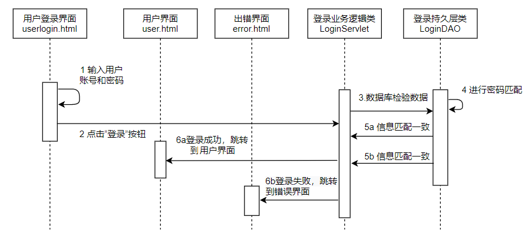

**2.用户注册**

​	描述：用户在进行注册操作时，需要在注册界面输入账号和密码，点击“注册”按钮，然后调用后台接口，会检查账号格式和是否存在，注册成功的话就跳转到用户登录界面，否则跳转到错误界面

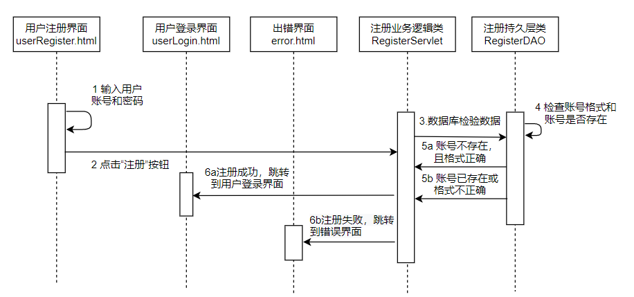

**3.用户浏览博客**

​	描述：游客浏览博客时可以输入要浏览的博客信息，调用博客信息逻辑类进行处理，会对博客信息进行匹配，匹配成功的话将相应的博客信息展示在列表中，否则会进行相应的错误提示。

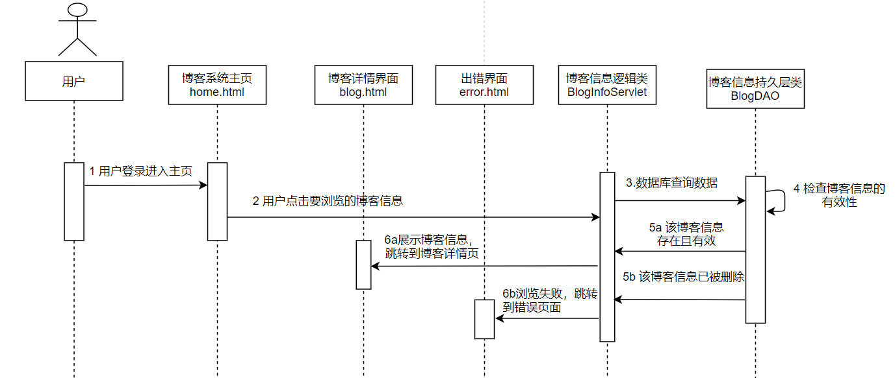

**4.博客管理**

描述：博主可以对博客进行管理，实现增删改查数据。

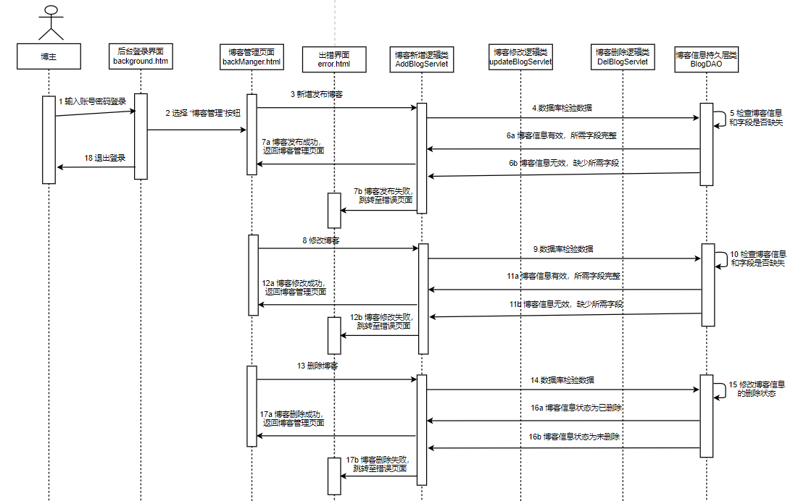

**5.博客搜索**

描述：用户可以输入关键字进行博客搜索，匹配成功就展示相关博客信息，匹配失败就显示没有相应的博客信息。

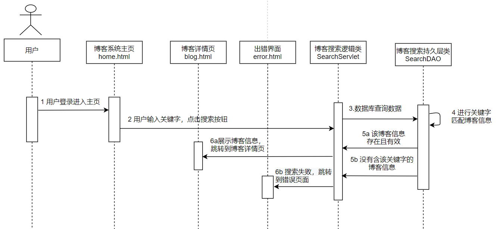

**6.用户管理**

描述：博主可以对用户信息进行管理，实现增删改查数据。

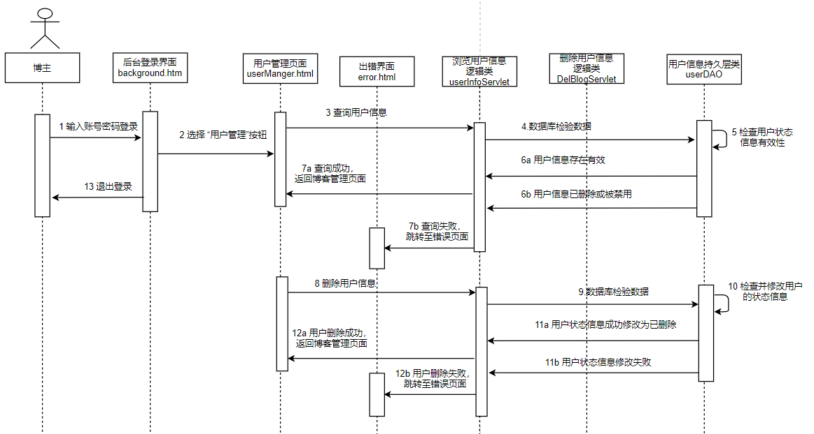

**7.用户评论**

描述：用户可以针对指定的博客信息发表自己的看法，输入评论内容，点击评论后，数据库会查询相关数据，检查评论信息是否符合要求，是否规范。评论成功会更新后显示招聘详情页；评论失败就会提示相关错误，跳转至错误界面。

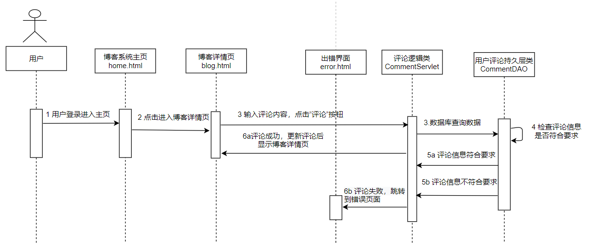


### 3.2 活动图

活动图是对功能模块很好的一种描述形式，这里主要列举了几个主要的核心功能模块进行活动图描绘，详细的活动图如下所示：

**1.浏览博客详情信息**

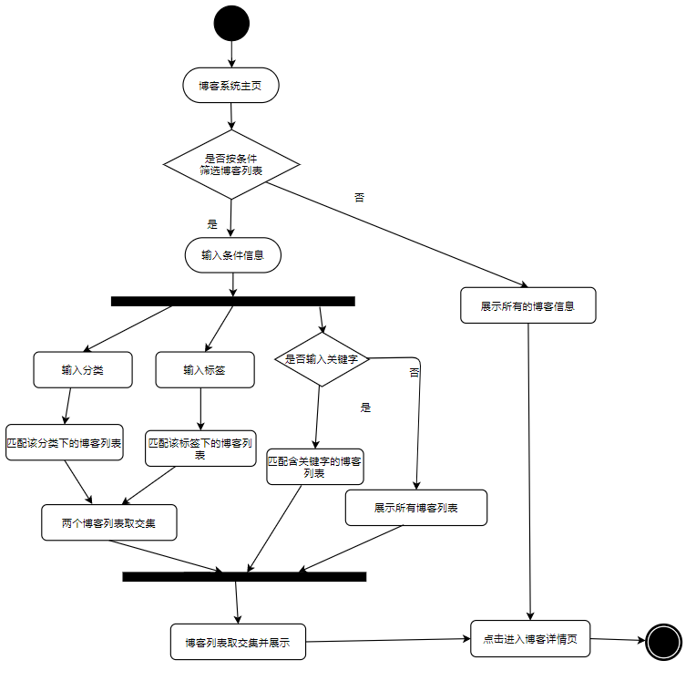

**2.用户进行评论**

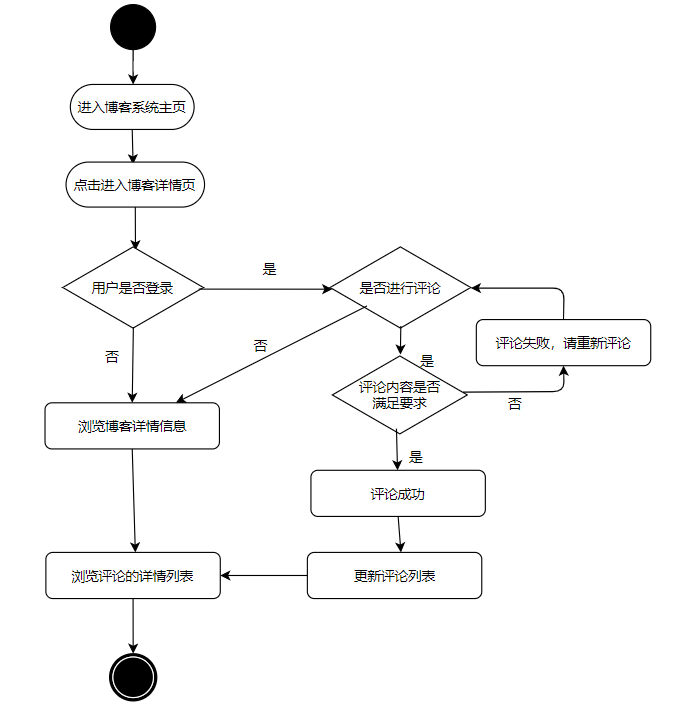

**3.博客管理**

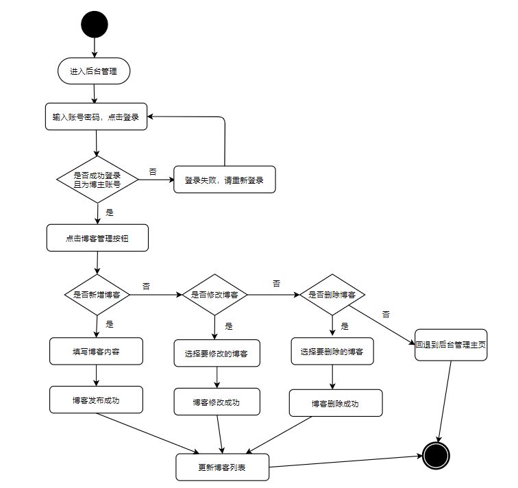


**4.分类管理**

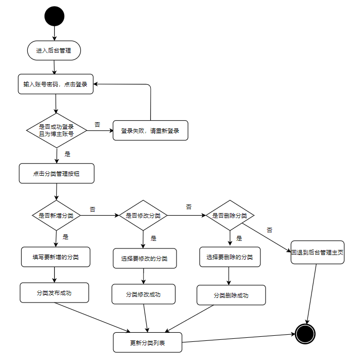

**5.评论管理**

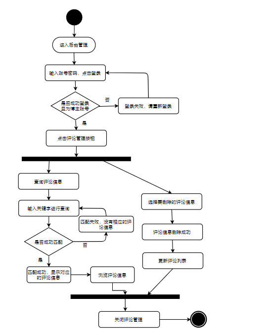

**6.用户管理**


# 五、编码实现
## 1.游客功能模块

### （1）浏览博客系统首页

​	程序编码后运行，访问http://localhost:8080/blogHome/home就能够进入博客系统的首页，在博客系统首页，可以看到博主的相关信息，博主发布的博客相关信息，博客的分类，可以按条件（如分类）和关键字进行搜索查询。

```java
@Controller
@RequestMapping("/blogHome")
public class HomeController {
    
    @Autowired
    private TbBlogService tbBlogService;
    @Autowired
    private TbBloggerService tbBloggerService;   
    @Autowired
    private TbCategoryService tbCategoryService;
    @Autowired
    private TbCommentService tbCommentService;

    @RequestMapping("/search")  //用以实现博客搜索
    public String search(@RequestParam String keyWord, Model model){
        keyWord="%"+keyWord+"%";
        List<BlogDetailVo> detailVoList = tbBlogService.queryAllBlogByTitle(keyWord);
        model.addAttribute("blogList",detailVoList);
        HashMap<String,Object> map = new HashMap<>();
        for(BlogDetailVo b:detailVoList){
            map.put(b.getBlogId()+"",tbCommentService.getCommentCount(b.getBlogId()));
        }
        model.addAttribute("countList",map);
        if (detailVoList.isEmpty()){
            return "blank";
        }
        return "content";
    }

    @RequestMapping("/home")	//首页访问
    public String home(Model model){
        TbBlogger blogger = tbBloggerService.selectAll();
        model.addAttribute("blogger", blogger);//存放博主信息
        List<TbCategory> categoryList = tbCategoryService.selectAll();
        model.addAttribute("categoryList",categoryList);//存放分类信息
        return "home";//首页显示，内嵌content.html内容
    }

    @RequestMapping("/toContent") //展示所有博客内容
    public String toContent(Model model){
        List<BlogDetailVo> tbBlogList = tbBlogService.queryAllBlog();
        model.addAttribute("blogList",tbBlogList);
        HashMap<String,Object> map = new HashMap<>();
        for(BlogDetailVo b:tbBlogList){
            map.put(b.getBlogId()+"",tbCommentService.getCommentCount(b.getBlogId()));
        }
        model.addAttribute("countList",map);
        return "content";//内容显示
    }

    @RequestMapping("/toContentByType/{id}")//按分类进行筛选博客
    public String toContentByType(@PathVariable Integer id, Model model ){
        TbBlog tbBlog = tbBlogService.queryBlog(id);
        tbBlog.setBlogCount(tbBlog.getBlogCount()+1);
        tbBlogService.updateBlog(tbBlog);
        HashMap<String,Object> map = new HashMap<>();
        List<BlogDetailVo> blogList = tbBlogService.queryAllBlogByTypeId(id);
        for(BlogDetailVo b:blogList){
            map.put(b.getBlogId()+"",tbCommentService.getCommentCount(b.getBlogId()));
        }
        model.addAttribute("countList",map);
        model.addAttribute("blogList",blogList);
        if (blogList.isEmpty()){
            return "blank";
        }
        return "content";
    }
```

### （2）游客对博客进行评论

​	用户可以选择指定的博客，点击进入相关的博客详情页面，针对博客信息可以在底部评论区进行评论。评论成功后会更新评论列表。主要编码实现如下：

```java
@Controller
@RequestMapping("/blogHome")
public class HomeController {

    @Autowired
    private TbBlogService tbBlogService;

    @Autowired
    private TbCommentService tbCommentService;
    
    @RequestMapping("/toBlog/{id}")//详情页跳转实现
	public String toBlog(Model model, @PathVariable int id){
  		TbBlog tbBlog = tbBlogService.queryBlog(id);
  		tbBlog.setBlogCount(tbBlog.getBlogCount()+1);
  	 	tbBlogService.updateBlog(tbBlog);
    	BlogDetailVo blog = tbBlogService.queryBlogById(id);
    	model.addAttribute("blog",blog);
    	List<CommentsVo> commentsList =
            	tbCommentService.getCommentsList(blog.getBlogId());
    	model.addAttribute("commentsList",commentsList);
    	int count = tbCommentService.getCommentCount(blog.getBlogId());
    	model.addAttribute("count",count);
    	TbUser tbUser = new TbUser();
    	tbUser.setUserId(1);
    	model.addAttribute("tbUser",tbUser);
    	return "blog";
	}
	@RequestMapping("/writeComment")//评论功能实现
	public String writeComment(Model model, TbComment tbComment){
    	tbComment.setCommentTime(new Date());
    	tbCommentService.addComment(tbComment);//调用service层新增评论的方法
    	BlogDetailVo tbBlog = tbBlogService.queryBlogById(tbComment.getBlogId());
    	model.addAttribute("blog",tbBlog);
    	List<CommentsVo> commentsList =
            	tbCommentService.getCommentsList(tbBlog.getBlogId());
    	model.addAttribute("commentsList",commentsList);//获取评论列表
    	int count = tbCommentService.getCommentCount(tbBlog.getBlogId());
   	 	model.addAttribute("count",count);
    	TbUser tbUser = new TbUser();
    	tbUser.setUserId(1);
    	model.addAttribute("tbUser",tbUser);
    	return "blog";
	}
}
```

## 2.博主后台管理模块

博主可以在博客系统首页点击登录后台的按钮，或者直接访问http://localhost:8080/blogger/toLogin跳转到后台登录界面，输入帐号admin 密码123456后，就可以进入后台管理页面了。在后台管理页面，博主可以进行博客管理，发布博客，评论管理，分类标签管理等功能，这里以核心功能发布博客、评论管理和分类管理功能进行阐明。

### （1）发布博客功能

​	博主在后台管理界面中，选择写博客操作，就进入了博客的编写界面。输入博客内容后，点击发布按钮，就会调用后台代码进行处理，其主要的代码实现如下：

```java
@Controller
public class BlogController {

    @Autowired
    private TbBlogService tbBlogService;
    @Autowired
    private TbCategoryService tbCategoryService;
    @Autowired
    private TbTagService tbTagService;
    @Autowired
    private TbBlogtagService tbBlogtagService;

    @RequestMapping("/toWriteBlog")
    public String toWriteBlog(Model model){
        List<TbCategory> tbCategoryList = tbCategoryService.selectAll();
        model.addAttribute("tbCategoryList",tbCategoryList);
        List<TbTag> tagList = tbTagService.queryAllTag();
        model.addAttribute("tagList",tagList);
        return "writeBlog";//编写博客界面
    }
    @RequestMapping("/writeBlog")//博客编写提交的功能实现
    public String writeBlog(TbBlog tbBlog, @RequestParam Integer tagId){
        tbBlog.setBlogCount(0);
        tbBlog.setBlogTime(new Date());
        tbBlogService.addBlog(tbBlog);
        TbBlogtag tbBlogtag=new TbBlogtag();
        tbBlogtag.setBlogId( tbBlogService.queryAllBlog().get(0).getBlogId());
        tbBlogtag.setTagId(tagId);
        tbBlogtag.setBlogTagTime(new Date());
        tbBlogtagService.addBlogTag(tbBlogtag);
        System.out.println(tbBlogtag);
        return "background";
    }

    @RequestMapping("/saveWriteBlog")//保存操作
    public String saveWriteBlog(TbBlog tbBlog){
        tbBlog.setBlogTime(new Date());
        tbBlogService.addBlog(tbBlog);
        return "background";
    }

}

```

### （2）分类管理功能

博主点击“分类管理”按钮可以进入管理界面，可以进行分类新增、分类修改、分类删除操作，系统会将博主的操作请求传递到后台接口，通过controller对应的请求接口调用相应的service层代码进行业务逻辑处理。主要的代码实现如下：

```java
@Controller
public class TbCategoryController {
    @Autowired
    private TbCategoryService tbCategoryService;

    @RequestMapping("/category")
    public String list(Model model) {//展示分类列表
        List<TbCategory> tbCategoryList = tbCategoryService.selectAll();
        model.addAttribute("tbCategoryList", tbCategoryList);
        return "category";
    }

    @RequestMapping("/toAddCategory")
    public String toAddCategory(Model model) {
        return "categoryAdd";//跳转分类新增界面
    }

    @RequestMapping("/addCategory")
    public String addCategory(TbCategory category) {//分类新增实现
        category.setCategoryTime(new Date());
        category.setCategoryState(1);
        tbCategoryService.addCategory(category);
        return "redirect:/category";//
    }

    @RequestMapping("/delCategory/{id}")
    public String deleteCategory(@PathVariable("id") int id) {//分类删除实现
        tbCategoryService.deleteCategory(id);
        return "redirect:/category";
    }

    @RequestMapping("/toUpdateCategory/{id}")
    public String toUpdateCategory(Model model, @PathVariable("id") int id) {
        model.addAttribute("category",tbCategoryService.selectById(id));
        return "categoryUpdate";//跳转到分类修改界面
    }

    @RequestMapping("/updateCategory")
    public String updateCategory(Model model, TbCategory tbCategory) {
        //分类新增实现
        tbCategoryService.updateCategory(tbCategory);
        tbCategory = tbCategoryService.selectById(tbCategory.getCategoryId());
        model.addAttribute("category", tbCategory);
        return "redirect:/category";
    }
}
```

### （3）评论管理功能

博主点击“评论管理”按钮可以进入管理界面，可以对游客评论进行浏览和删除操作，具体主要的实现代码如下：

```java
@Controller
public class CommentController {
    @Autowired
    private TbCommentService tbCommentService;

    @RequestMapping("/toCommentManger")
    public String toCommentManger(Model model){//展示评论信息列表
        List<CommentsVo> commentsVoList = tbCommentService.getCommentsVoList();
        model.addAttribute("commentsVoList",commentsVoList);
        return "commentManger";
    }

    @RequestMapping("/delComment/{id}")
    public String delComment(@PathVariable("id") int id){//删除评论 实现
        tbCommentService.deleteComment(id);
        return "redirect:/toCommentManger";
    }

}
```

# 六、测试和部署 

## （1）软件单元测试
​		经过软件的前期大部分工作，我们对所需功能进行了编码实现，接下来就需要对这个功能进行单元测试，检查输入参数和返回结果是否符合预期需求，并尽可能发现软件功能中存在的问题。而对每个功能模块进行测试，例如对某个类的某个方法的测试，我们就可以使用单元测试框架JUnit。

​		JUnit是一款优秀的开源Java单元测试框架，也是目前使用率最高最流行的测试框架，开发工具IDEA对JUnit都有很好的支持，JUnit主要用于白盒测试和回归测试。我们前面采用的是springboot搭建的系统框架，如果需要使用JUnit框架，我们只需要在pom.xml引入该框架的支持即可。pom.xml文件如下：

```xml
<dependency>    
    <groupId>org.springframework.boot</groupId>    
    <artifactId>spring-boot-starter-test</artifactId>    
    <scope>test</scope> 
</dependency>
```

​		这样子我们就成功引入JUnit依赖，我们在需要测试的方法引入相关的注解声明这是一个测试方法，常见注解有：@SpringBootTest：获取启动类、加载配置，确定装载Spring Boot；@Test：声明需要测试的方法；@Before：每个测试方法前都会执行的方法。在这里我们就使用@Test注解声明测试方法。我们采用的是断言测试，断言测试也就是期望值测试，是单元测试的核心也就是决定测试结果的表达式，Assert对象中的主要断言方法：① Assert.assertEquals 对比两个值相等 ②Assert.assertEquals 对比两个值相等 ③Assert.assertNull 验证null Assert.assertArrayEquals 对比两个数组相等。

​		主要功能测试代码如下：

```java
@SpringBootTest
@MapperScan("com.yycoder.blog.dao")
class BlogApplicationTests {

    @Autowired
    private TbBlogMapper tbBlogMapper;
    @Autowired
    private TbCommentService tbCommentService;
	@Autowired
    private TbCategoryService tbCategoryService;
    
    @Test
    void testComment(){//测试评论功能
        TbComment tbComment=new TbComment();//模拟一个评论实体类
        tbComment.setBlogId(2);
        tbComment.setCommentTime(new Date());
        tbComment.setUserId(4);
        tbComment.setCommentContent("-------测试评论--------");
        Integer comment = tbCommentService.addComment(tbComment);
        List<CommentsVo> commentsList = tbCommentService.getCommentsList(2);
        System.out.println(commentsList.get(commentsList.size()-1));//获取最新评论
        //测试返回结果，预期comment返回是0，不为0报错信息
        Assert.assertFalse("评论成功",comment==1);
    }
    @Test
    void testGetBlogById(){
        //测试博客里按id获取内容
        BlogDetailVo detailVo = tbBlogMapper.queryBlogById(1);
        System.out.println(detailVo);//打印结果
        Assert.assertNotNull(detailVo);//如果返回的detail不为空，无报错信息
        //假定我们预期detail为空，返回的detail不为空，打印报错消息
        Assert.assertTrue("返回的结果不为空",detailVo==null);
    }
    @Test
    void testBlogSearch(){
        //测试博客里的搜索功能。%spring% 模糊匹配spring关键字
        List<BlogDetailVo> detailVoList = tbBlogMapper.queryAllBlogByTitle("%spring%");
        for (BlogDetailVo blogDetailVo:detailVoList){
            Assert.assertNull(blogDetailVo);//如果blogDetailVo不为空，报错消息
        }
    }
    @Test
    void testGetCategoryList() {//测试获取分类列表
        List<TbCategory> categoryList = tbCategoryService.selectAll();
        for (TbCategory tbCategory:categoryList){
            System.out.println(tbCategory);
        }
        Assert.assertTrue("查询结果为空",categoryList!=null);
    }
}
```

我们以测试评论功能为例子，运行测试后得到的测试结果如下：


​		可以看到，我们评论成功的，数据已经存入数据库，我们采用assertFasle(msg,condition)进行测试，我们condition为comment==1(代表评论成功返回1)，预期结果与返回结果一致，但是我们采用该测试方法是结果一致的话就打印报错消息，所以我们看到了评论成功的消息提示。当然我们可以采用assertTrue,结果一致的话是没有报错消息提示的。

​		我们针对了以上几个主要功能进行测试，我们可以发现断言测试几个比较常用的测试方法，通过预期结果与返回结果是否符合，对应的提供相应的报错信息，也可以通过打印的方式更加具体的体现返回的数据。对于其他还没进行测试到的功能我们也可以采用断言测试一一排除存在的问题。

## （2）集成测试

在进行了编码实现后，我们进行了单元测试，从中我们通过测试也发现大部分功能是正常的，但这些测试还不足以说明该系统功能就能完全正常的了，为了尽可能发现系统中存在的隐藏问题，下面我们针对前端和后台数据进行交互的界面上输入动作进行测试。针对主要功能进行集成测试，测试的用例如下所示：

**用户登陆流程测试用例**

| 编号            | 输入动作                         | 期望结果                                        | 真实结果                                        | 备注 |
| --------------- | -------------------------------- | ----------------------------------------------- | ----------------------------------------------- | ---- |
| Testcase001-dl1 | 使用合法用户名和密码登陆         | 登陆成功                                        | 登陆成功                                        |      |
| Testcase001-dl2 | 使用错误的用户名或密码登陆       | 显示用户名或密码错误提示信息                    | 显示用户名或密码错误提示信息                    |      |
| Testcase001-dl3 | 用户名为空登陆                   | 显示请输入用户名提示信息                        | 显示请输入用户名提示信息                        |      |
| Testcase001-dl4 | 改变合法用户名或密码的大小写登陆 | 显示用户名或密码错误提示信息                    | 显示用户名或密码错误提示信息                    |      |
| Testcase001-dl5 | 在合法用户名或密码中插入空格     | 显示用户名或密码错误提示信息                    | 显示用户名或密码错误提示信息                    |      |
| Testcase001-dl6 | 使用已被删除的账号登陆           | 显示不存在此用户等相应提示信息                  | 显示不存在此用户等相应提示信息                  |      |
| Testcase001-dl7 | 密码为空进行登陆                 | 显示请输入密码，密码不能为空提示信息            | 显示请输入密码，密码不能为空提示信息            |      |
| Testcase001-dl8 | 用户名和密码均为空登陆           | 显示请输入用户名和密码提示信息                  | 显示请输入用户名和密码提示信息                  |      |
| Testcase001-dl9 | 账号含特殊字符输入               | 显示请输入正确的用户，且不能包含!、@、#特殊字符 | 显示请输入正确的用户，且不能包含!、@、#特殊字符 |      |

**博客信息浏览功能测试**

| 编号            | 输入动作                                   | 期望结果                                          | 真实结果                                          | 备注 |
| --------------- | ------------------------------------------ | ------------------------------------------------- | ------------------------------------------------- | ---- |
| Testcase002-dl1 | 博客信息存在且有效                         | 成功展示博客详情页                                | 成功展示博客详情页                                |      |
| Testcase002-dl2 | 博客信息已被删除                           | 显示博客已被删除的提示信息                        | 显示博客已被删除的提示信息                        |      |
| Testcase002-dl3 | 输入指定分类，该分类下含有博客信息         | 成功展示对应分类的博客信息                        | 成功展示对应分类的博客信息                        |      |
| Testcase002-dl4 | 输入指定分类，该分类下不含有博客信息       | 提示该分类下无博客信息，存在“0”条博客             | 提示该分类下无博客信息，存在“0”条博客             |      |
| Testcase002-dl5 | 输入指定标签，该标签下含有博客信息         | 成功展示对应标签的博客信息                        | 成功展示对应标签的博客信息                        |      |
| Testcase002-dl6 | 输入指定标签，该标签下不含有博客信息       | 提示该标签下无博客信息，存在“0”条博客             | 提示该分类下无博客信息，存在“0”条博客             |      |
| Testcase002-dl7 | 输入指定分类和标签，且含有相应的博客信息   | 成功展示对应分类和标签的博客信息                  | 成功展示对应分类和标签的博客信息                  |      |
| Testcase002-dl8 | 输入指定分类和标签，且不含有相应的博客信息 | 提示该分类标签组合条件下无博客信息，存在“0”条博客 | 提示该分类标签组合条件下无博客信息，存在“0”条博客 |      |

**用户评论功能测试**

| 编号             | 输入动作                                         | 期望结果                                   | 真实结果                                       | 备注 |
| ---------------- | ------------------------------------------------ | ------------------------------------------ | ---------------------------------------------- | ---- |
| Testcase003-dl1  | 点击要进入的博客（存在未删除）                   | 成功展示博客的详情页                       | 成功展示博客的详情页                           |      |
| Testcase003-dl2  | 点击要进入的博客（已被删除）                     | 提示该博客已被博主删除，无法查看的错误信息 | 提示该博客已被博主删除，无法查看的错误信息     |      |
| Testcase003-dl3  | 用户未登录进行博客评论                           | 显示用户未登录，无法进行评论的错误信息     | 显示用户未登录，无法进行评论的错误信息         |      |
| Testcase003-dl4  | 用户登录后输入符合规范要求的内容进行评论         | 评论成功，评论列表显示新评论的数据         | 评论成功，评论列表显示新评论的数据             |      |
| Testcase003-dl5  | 用户登录后输入不符合规范要求的内容进行评论       | 提示评论失败，不符合规范要求的错误信息     | 提示评论失败，不符合规范要求的错误信息         |      |
| Testcase003-dl6  | 用户登录后输入评论内容为空进行评论               | 提示评论失败，评论内容不能为空             | 提示评论失败，评论内容不能为空                 |      |
| Testcase003-dl7  | 用户针对某条评论，输入符合规范的回复内容进行回复 | 回复成功，在对应的评论下面出现回复的信息   | 回复成功，在对应的评论下面出现回复的信息       |      |
| Testcase003-dl8  | 用户点击自己评论（没有其他人回复）的删除按钮     | 成功删除该评论                             | 成功删除该评论                                 |      |
| Testcase003-dl9  | 用户点击自己评论（已有其他人回复）的删除按钮     | 可以正常删除评论及相应的回复               | 提示删除评论失败，该评论已被别人回复的错误信息 |      |
| Testcase003-dl10 | 用户输入正确的账号和密码进行登录                 | 显示账号密码正确，登录成功                 | 显示账号密码正常，登录成功                     |      |

**博客信息管理测试**

| 编号             | 输入动作                                                 | 期望结果                                     | 真实结果                                     | 备注 |
| ---------------- | -------------------------------------------------------- | -------------------------------------------- | -------------------------------------------- | ---- |
| Testcase004-dl1  | 输入符合格式的博客，点击发布按钮                         | 显示发布成功，更新博客列表                   | 显示发布成功，更新博客列表                   |      |
| Testcase004-dl2  | 输入不符合格式或缺少字段内容的博客，点击发布按钮         | 提示发布失败，缺少相关字段内容的错误信息     | 提示发布失败，缺少相关字段内容的错误信息     |      |
| Testcase004-dl3  | 选择要修改的博客，输入符合格式的博客信息，点击更改按钮   | 显示修改成功，更新博客列表                   | 显示修改成功，更新博客列表                   |      |
| Testcase004-dl4  | 选择要修改的博客，输入不符合格式的博客信息，点击更改按钮 | 提示修改失败，缺少相关字段内容的错误信息     | 提示修改失败，缺少相关字段内容的错误信息     |      |
| Testcase004-dl5  | 选择要删除的博客，点击删除按钮后博客状态信息变为已删除   | 显示删除成功，博客状态信息成功改变，更新列表 | 显示删除成功，博客状态信息成功改变，更新列表 |      |
| Testcase004-dl6  | 选择要删除的博客，点击删除按钮后博客状态信息未改变       | 提示博客删除失败，请重试等错误信息           | 提示博客删除失败，请重试等错误信息           |      |
| Testcase004-dl7  | 点击“博客管理”按钮                                       | 成功进入博客管理操作页面，展示博客信息列表   | 成功进入博客管理操作页面，展示博客信息列表   |      |
| Testcase004-dl8  | 点击“退出登录”按钮                                       | 成功退出系统，返回登录页面                   | 成功退出系统，返回登录页面                   |      |
| Testcase004-dl9  | 输入正确的账号和密码                                     | 成功登录博客后台管理系统                     | 成功登录博客后台管理系统                     |      |
| Testcase004-dl10 | 输入错误的账号或密码                                     | 提示登录失败，重新输入账号和密码的错误信息   | 提示登录失败，重新输入账号和密码的错误信息   |      |

**博客信息搜索功能测试**

| 编号            | 输入动作                                               | 期望结果                                     | 真实结果                                     | 备注 |
| --------------- | ------------------------------------------------------ | -------------------------------------------- | -------------------------------------------- | ---- |
| Testcase005-dl1 | 输入关键字，且有博客含该关键字                         | 展示含该关键字的博客信息列表                 | 展示含该关键字的博客信息列表                 |      |
| Testcase005-dl2 | 输入关键字，且没有博客含该关键字                       | 提示搜索结果为空，0条博客信息的错误信息      | 提示搜索结果为空，0条博客信息的错误信息      |      |
| Testcase005-dl3 | 搜索栏没有输入关键字                                   | 显示所有的博客信息列表                       | 显示所有的博客信息列表                       |      |
| Testcase005-dl4 | 在关键字（有博客信息存在该关键字）中间添加空格进行搜索 | 提示信息匹配不一致，不存在博客信息的错误信息 | 提示信息匹配不一致，不存在博客信息的错误信息 |      |
| Testcase005-dl5 | 搜索栏输入关键字为空格组合                             | 提示搜索结果为空，0条博客信息的错误信息      | 提示搜索结果为空，0条博客信息的错误信息      |      |
| Testcase005-dl6 | 搜索栏输入的关键字为分类字段下的属性                   | 不会显示该分类下的博客，会提示搜索结果为0    | 不会显示该分类下的博客，会提示搜索结果为0    |      |
| Testcase005-dl7 | 搜索栏输入的关键字为标签字段下的属性                   | 不会显示该标签下的博客，会提示搜索结果为0    | 不会显示该标签下的博客，会提示搜索结果为0    |      |

## （3）软件安装和部署

- **IntelliJ IDEA 安装**

  进入[IntelliJ IDEA 官网](https://www.jetbrains.com/idea/) ，根据自己的操作系统下载相应的安装包。由于该个人博客系统是用idea进行开发的，使用idea打开运行项目比较方便，使用其他编译器的话容易出现各种未知问题。安装步骤，只需要根据说明一直next下去直到finish完成，在安装过程可以根据自身情况设置安装存放的路径、配置信息。

- **Maven管理包和JDK环境安装**
  - maven管理包可以去[Apache Maven官网](maven.apache.org/download.cgi)，在开发该系统时采用的是 apache-maven-3.5.4-bin.zip，为了不出现版本兼容问题，建议下载3.5.x版本的文件夹。下载完后，在电脑的环境配置进行变量配置，cmd命令行输入 mvn –version，如果可以看到相应版本信息，就说明 Apache Maven 在 Windows 上已安装成功。
  - 配置Java环境前要先去[JDK 官网](https://www.oracle.com/java/technologies/javase/javase-jdk8-downloads.html)下载相应版本的JDK安装包，建议下载JDK 1.8版本，整个软件所使用的环境也是1.8的环境，如果使用1.8版本以前的JDK安装包可能会出现某些方法不能使用的情况。下载完毕后也要在电脑的环境变量path配置jdk的路径，配置完毕后在cmd命令行输入java -version ，如果可以看到相应版本信息，就说明 jDK 环境安装和配置成功。

- **mysql数据库安装**

  首先去[MySQL官网](http://www.mysql.com)浏览，根据操作系统下载相应版本的MySQL，等下载完毕后，也在电脑的环境变量path配置jdk的路径，我们可以在MYSQL存放路径下的bin文件打开mysql.exe，如果可以正常打开即表示安装成功。为了确保登录mysql正常，我们可以直接cmd命令行打开，输入mysql -u root -p 回车，按提示输入密码，如果能成功进行mysql操作界面，就代表MYSQL服务安装成功，可以操作MYSQL数据库了。

- **项目部署**

  按照上面的步骤，我们已经把所需要的环境都安装好了，现在进行项目部署运行：

  ① 用IDEA打开项目以maven project的形式打开，并在setting修改好maven的配置，同时要保证JDK1.8的环境是正常的，这样子才可以确保依赖和方法是可以正常引入的。

  ②待maven加载依赖以后，在扩展包可以查看到很多jar包，就代表依赖引入是正常的，使用maven -install将项目本身编译并打包到本地仓库。

  ③mysql连接要确保是正常的，没有任何错误消息的提示。然后点击右上角的项目运行按钮，看到控制台输出springboot标记就代表项目正在运行，一段时间后运行端口8080出现，且无报错信息，就代表整个项目运行是正常的，接下来就可以进行页面的访问了。

# 七、回顾和展望

​		本文系统论述了个人博客系统的发展及现状和研究目标，以及开发该系统的实用性和必要性。在开发该系统的过程中，进行了需求分析、概念结构设计、逻辑结构设计、编码实现等环节。在进行了深入的分析之后，我采用了高级Java语言作为开发语言，MySQL作为后台数据库，利用web开发流行的框架springboot+thymeleaf使开发的业务逻辑实现更加清晰，利用可视化界面navicat管理数据库，进行前后端界面和数据库的开发，成功开发了基于B/S架构的个人博客系统。

​		本系统实现了博客系统具有的基本功能，博主可以进行发布博客，进行博客管理，评论管理，用户可以浏览博客信息，按关键字进行搜索，在博客信息进行评论等。而且界面简单容易，与用户的交互性良好，很容易上手使用，基本上普通大众都能将该系统作为个人博客网站，操作方便简单。提高了个人对博客的整理，可以发博客来记录自己的生活。

​		由于自己在编码方面的能力还是欠缺一点，在页面设计上没有太多丰富，一些错误提示也可能没有很到位，加上课程设计的时间较紧，所以本系统的很多方面还待完善开发了该系统后，有了很深刻的体会，也学习了许多东西。在接下来得到学习中，我会不断深入研究，不断优化个人博客系统。

